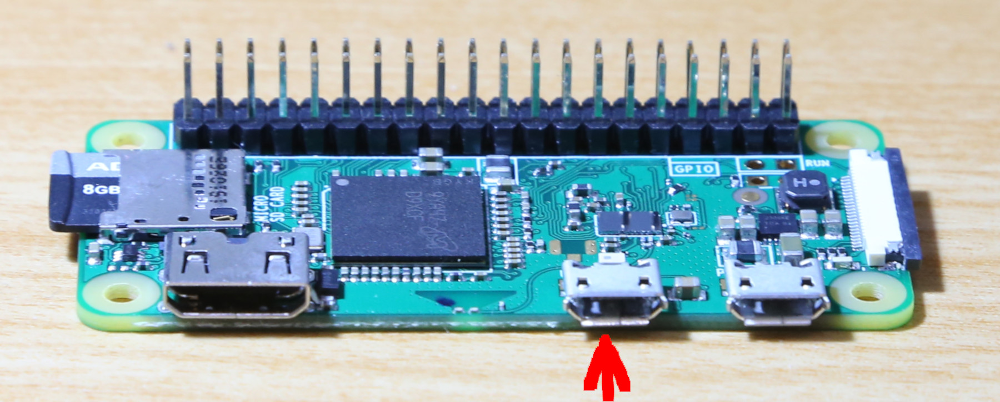
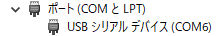
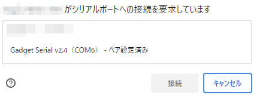

# PiZeroWebSerialConsole
PCのUSB端子に接続した[Raspberry Pi Zero](https://www.raspberrypi.org/products/raspberry-pi-zero/)のコンソール(コマンドプロンプト)をWebブラウザから使用できます。

* Raspberry Pi ZeroのUSB OTGシリアルとWeb Serial APIを使用しているため、IP設定は不要です。(Pi Zero WがWiFi接続されていない状態でも使用可能)
* 簡易なファイルマネージャ機能があり、PCとRaspberry Piとの間でファイルの送受信ができます。
* [Monaco Editor](https://microsoft.github.io/monaco-editor/)を搭載、テキストファイルの編集ができます。
* [Raspberry Pi Zero W](https://www.raspberrypi.org/products/raspberry-pi-zero-w/)のWiFi設定のための専用UIがあります。

## 準備
USB OTG Serialのコンソールが有効化されたRaspberry Pi OSが動作しているRaspberry Pi Zero (W)が必要です。
* あらかじめUSB OTG Serialのコンソールの有効化を含め、[CHIRIMEN開発環境が設定されたこちらのOSイメージ](https://github.com/kou029w/chirimen-os/releases/)を使うと簡単です。
* 自分で設定するには、[Raspberry Pi OS Lite](https://www.raspberrypi.org/software/operating-systems/#raspberry-pi-os-32-bit)を導入し、[USB OTG Serialのコンソールを有効化](https://gist.github.com/satakagi/dd34c29b0192540080681e2443258282)します。
* Note: Pi ZeroのこのポートがUSB OTGポートです。

## 使用
* PCのUSBとRaspberry Pi ZeroのUSB OTGポートをUSBケーブルでつなぎます
  * PCからのUSB給電でRaspberry Pi Zeroが起動します。
  * PCでRaspberry Pi Zeroが認識されたことを確認します (Windows10のデバイスマネージャの例) (起動してUSBデバイスとして出現するまでにしばらく(数十秒)かかります)
  
* [こちらのページ](https://chirimen.org/PiZeroWebSerialConsole/PiZeroWebSerialConsole.html)にブラウザでアクセス(Chrome, Edgeで確認)
* CONNECTボタンを押す
  * 接続ダイアログが出現
  
  * 上で認識したデバイス（ポート番号）を接続する
